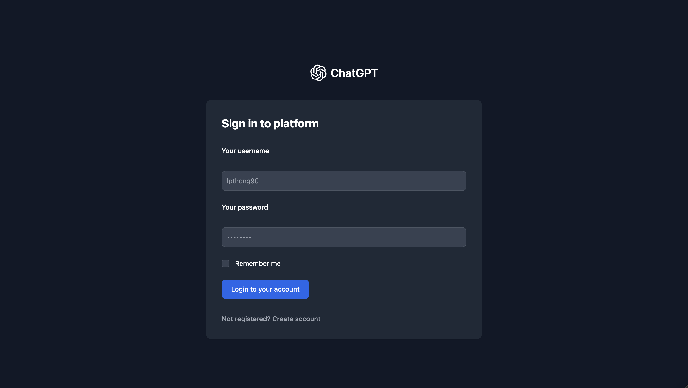
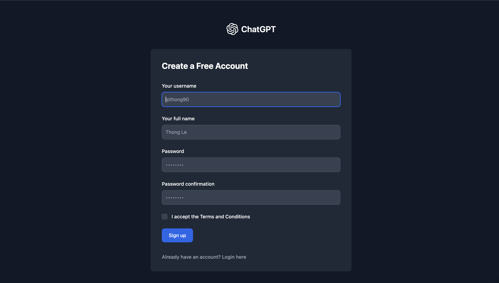
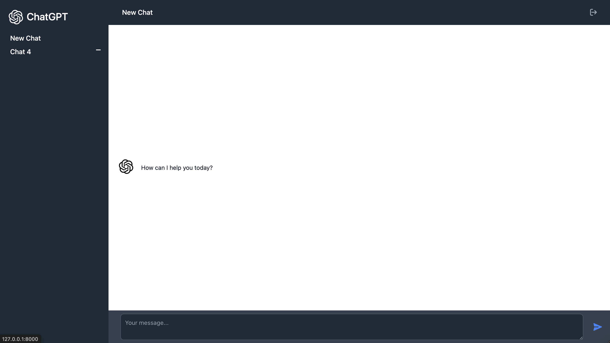
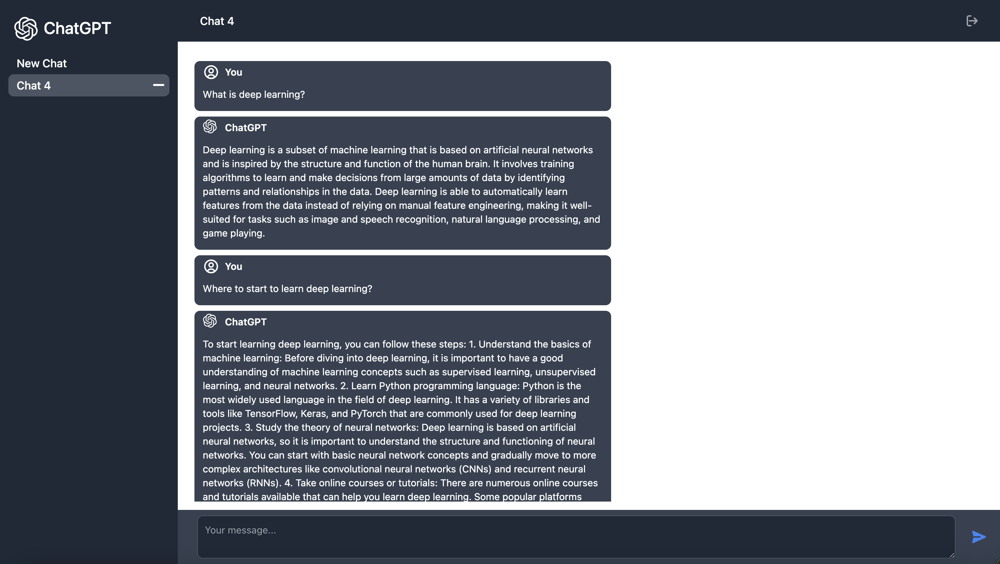

<p align="center">
    <a href="https://github.com/lpthong90/django-chatgpt">
      
    </a> 
    <br>
    <em>Using Django to demo a simple ChatGPT version of OpenAI.</em>
</p>

---

**Documentation**: <a href="https://lpthong90.dev/django-chatgpt" target="_blank">https://lpthong90.dev/django-chatgpt</a>

**Source  Code**: <a href="https://github.com/lpthong90/django-chatgpt" target="_blank">https://github.com/lpthong90/django-chatgpt</a>

---

# Features
- Register new user accounts
- Authentication users
- Chat with ChatGPT

# Related Services
- ChatGPT OpenAI => To get `OPENAI_API_KEY`

# Environment Variables
```
OPENAI_API_KEY=<OPENAI_API_KEY>
```


# Run
``` bash
> ./scripts/dev.sh 
```

# Screenshots





# Video demo:

<p align="center">
    <iframe width="800" height="450" src="https://www.youtube.com/embed/aHzL0hrCc-o?si=wd869ETzx44F4H52" title="YouTube video player" frameborder="0" allow="accelerometer; autoplay; clipboard-write; encrypted-media; gyroscope; picture-in-picture; web-share" allowfullscreen></iframe>
</p>
